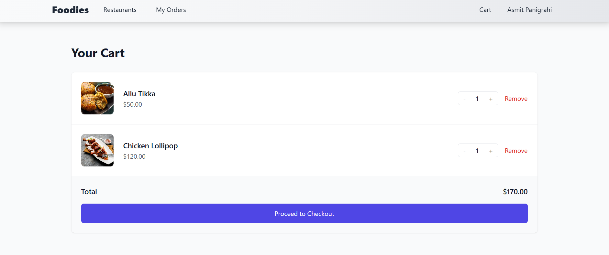
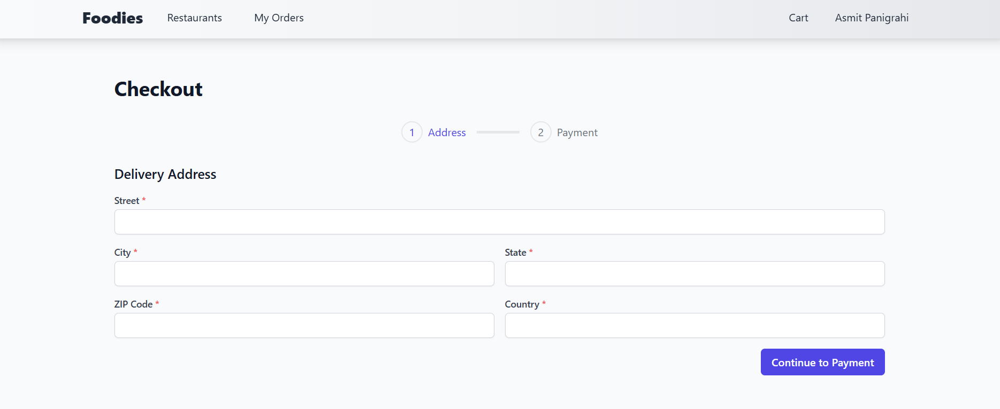
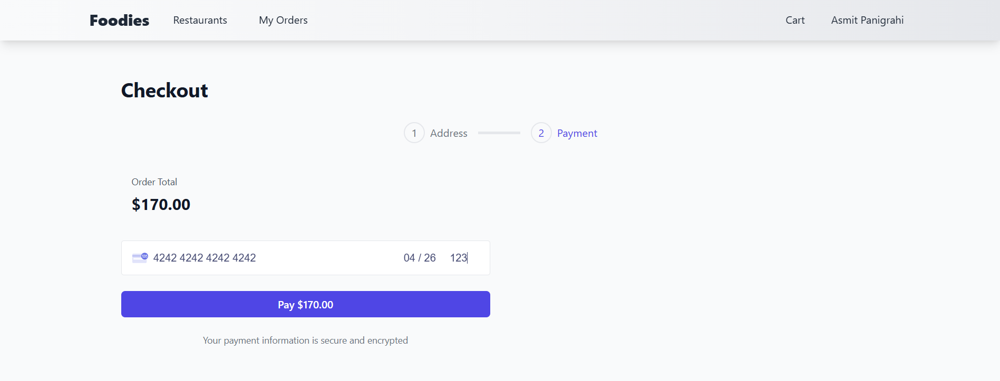
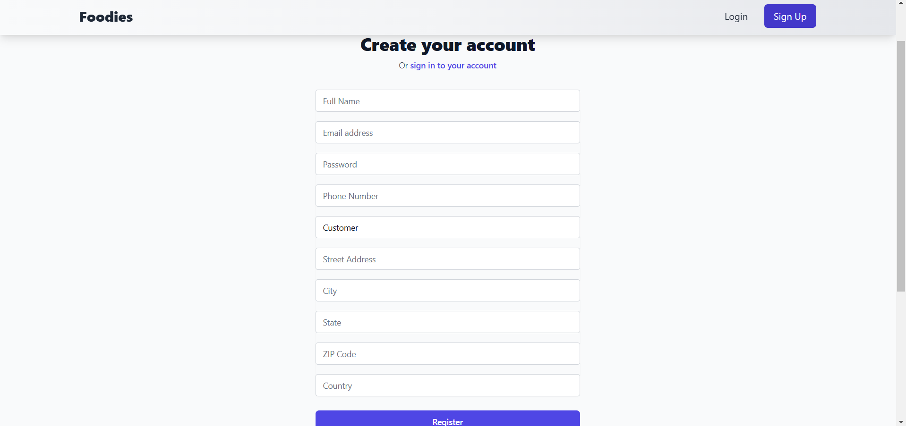
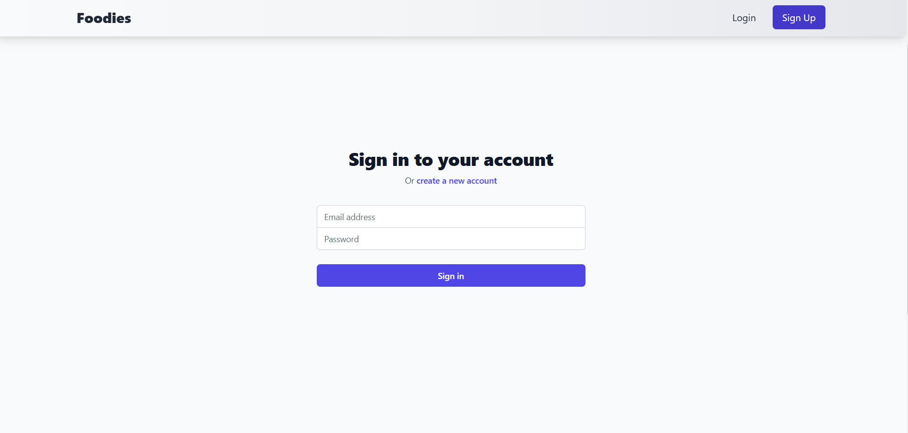

# Foodies - Food Delivery Application

## Overview
Foodies is a comprehensive food delivery application designed to provide users with a seamless and enjoyable experience when browsing, ordering, and managing food deliveries. The application leverages modern web technologies to offer a responsive and user-friendly interface that works flawlessly across various devices. Whether you're craving a quick snack or planning a full-course meal, Foodies makes it easy to find and order your favorite dishes from local restaurants.

The application features a robust backend built with Node.js and Express, ensuring secure and efficient handling of user data and orders. With MongoDB as the database, Foodies can store and retrieve data quickly and reliably. The frontend, developed using React and Tailwind CSS, provides a visually appealing and intuitive user interface. Additionally, the integration of Cloudinary allows for efficient media management, ensuring that images and other media files are handled seamlessly.

Foodies also prioritizes security, with features like JWT-based user authentication, input sanitization, and secure HTTP headers. The application is designed to be scalable and maintainable, making it a reliable choice for both users and developers.

## Tech Stack
- **Frontend:**
  - React: A JavaScript library for building user interfaces, allowing for the creation of reusable UI components.
  - React Router: A library for routing and navigation within the application, enabling single-page application (SPA) behavior.
  - Axios: A promise-based HTTP client for making requests to the backend API.
  - React Hot Toast: A library for displaying notifications and alerts in the application.
  - React Icons: A library for incorporating a wide range of icons in your components.
  - Tailwind CSS: A utility-first CSS framework for quickly styling the application with predefined classes.

- **Backend:**
  - Express: A web application framework for Node.js, providing a robust set of features for building web applications.
  - Mongoose: An Object Data Modeling library for MongoDB, providing a straightforward way to model application data.
  - MongoDB: A NoSQL database used for storing application data, offering flexibility and scalability.
  - jsonwebtoken: A library for creating and verifying JSON Web Tokens (JWT), used for secure user authentication.
  - Cloudinary: A cloud-based service for managing and storing media files, offering features like image optimization and transformation.
  - Helmet: A middleware that helps secure Express apps by setting various HTTP headers, protecting against common web vulnerabilities.
  - cors: Middleware to enable Cross-Origin Resource Sharing, allowing the frontend to communicate with the backend.
  - bcryptjs: A library for hashing and securing passwords, ensuring user credentials are stored securely.
  - dotenv: A module for loading environment variables from a `.env` file, keeping sensitive configuration out of the codebase.
  - morgan: HTTP request logger middleware, providing detailed logs of incoming requests for debugging and monitoring.
  - multer: Middleware for handling file uploads, enabling users to upload images and other files.
  - compression: Middleware to compress response bodies, improving the performance of the application.
  - nodemon: A development tool that automatically restarts the server when file changes are detected, enhancing the development workflow.
  - stripe: A library for handling payments, allowing users to make secure online payments for their orders.


## Deployment

- **Frontend:** Deployed on Vercel.
- **Backend:** Deployed on Render. Note that Render may take some time to connect, with an initial startup time ranging from 30 to 60 seconds.

## Presentation Files

- **Foodies-Food-Delivery.pptx**: A PowerPoint presentation detailing the food delivery service.
- **Foodies.docx**: A document providing additional information about the food delivery service.

## Website Images

### All Restaurants

Description: A page displaying all registered restaurants.

### Cart

Description: The shopping cart page where users can view selected items.

### Checkout

Description: The checkout page for finalizing purchases.

### Customer Orders Page

Description: A page displaying customer orders.

### Filter by Category

Description: Allows users to filter menu items by category.

### Item Details Owner

Description: Detailed view of an item for the owner.

### Menu Item Details

Description: Detailed view of menu items.

### New Owner

Description: Interface for adding a new restaurant owner.

### Order Management

Description: Page for managing orders.

### Payment

Description: Payment processing interface.

### Register

Description: Registration page for new users.

### Restaurant Owner Menu Management

Description: Management interface for restaurant owners.

### Restaurant Owner Dashboard

Description: Dashboard for restaurant owners to manage their information.

### Restaurant Page

Description: Page displaying details of a specific restaurant.

### Restaurant Profile

Description: Profile page for a restaurant.

### Home Page

Description: The main landing page of the website.

### Login

Description: User login page.


## Installation

### Prerequisites
- Node.js (>= 18.0.0)
- MongoDB (for backend)

### Clone the Repository
```bash
git clone https://github.com/AsmitPanigrahi/Foodies-F-B.git
```

### Frontend Setup
1. Navigate to the frontend directory:
   ```bash
   cd frontend
   ```
2. Install dependencies:
   ```bash
   npm install
   ```
3. Create a `.env` file in the frontend directory and add your environment variables (e.g., API URL, Stripe Publishable key, JWT SECRET and Cloudinary credentials)

### Backend Setup
1. Navigate to the backend directory:
   ```bash
   cd ../Foodies
   ```
2. Install dependencies:
   ```bash
   npm install
   ```
3. Create a `.env` file in the backend directory and add your environment variables (e.g., MongoDB URI, Frontend URL, JWT SECRET, Stripe Secret key, Cloudinary credentials).

### Running the Application
1. Start the backend server:
   ```bash
   npm run dev
   ```
2. Start the frontend application:
   ```bash
   cd frontend
   npm run dev
   ```

## Usage
- Access the application in your browser at `http://localhost:3000`.
- Register or log in to start ordering food.
